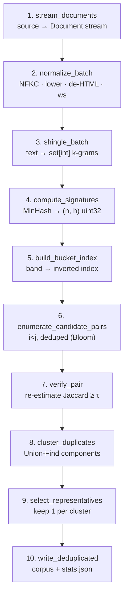

# dedup_pipeline — Production MinHash/LSH Data Curation

A production-ready text **deduplication pipeline** built around MinHash
near-duplicate detection and Locality-Sensitive Hashing (LSH). It scales to
100M+ document corpora and drops into standard ML preprocessing workflows — the
same class of cleaning applied to The Pile, RedPajama, and FineWeb
[Lee et al. 2022]. Removing duplicates reduces memorization, curbs bias
amplification, prevents benchmark contamination, and cuts training compute.

## Architecture — the 10 pipeline stages



```
shingles → MinHash signatures → LSH bands → candidate pairs → verify
        → Union-Find clusters → representatives → cleaned corpus
```

Each stage is independently callable, logs its counts/timing, and checkpoints its
output so a failed run resumes at the first incomplete stage.

## Dependencies (why each one)

| Library | Why |
|---|---|
| `numpy` | Vectorized signatures, banding, and the segmented-min reduce — the perf core. |
| `scipy` | Chi-squared test backing the hash-uniformity test. |
| `xxhash` | Fast, process-stable 64-bit hashing of shingle strings. |
| `mmh3` | MurmurHash3 probes for the candidate-pair Bloom filter. |
| `pydantic` + `pydantic-settings` | Typed, validated, env/file-backed configuration (no magic numbers). |
| `typer` | Declarative, type-checked command-line interface. |
| `pyarrow` | Streaming Parquet read/write for columnar corpora. |
| `datasets` *(extra `hf`)* | Streams HuggingFace Hub datasets as a source. |
| `numba` *(extra `fast`)* | Optional JIT inner loop for signature computation at scale. |

Dev/test: `pytest`, `pytest-cov`, `pytest-benchmark`, `hypothesis`, `ruff`, `mypy`.

## Quick start

```bash
# 1. Install the package with dev + fast extras (editable).
pip install -e ".[dev,fast]"

# 2. Create a tiny sample corpus (3 docs, 2 identical).
printf '{"id":"a","text":"the quick brown fox"}\n{"id":"b","text":"the quick brown fox"}\n{"id":"c","text":"a wholly different sentence"}\n' > sample.jsonl

# 3. Inspect the corpus (counts, lengths, exact-dup estimate) without changing it.
dedup inspect --source sample.jsonl

# 4. Deduplicate it; writes deduped.jsonl + deduped_stats.json.
dedup deduplicate --source sample.jsonl --dest deduped.jsonl

# 5. Verify quality (lint, strict types, tests, ≥90% coverage).
ruff check dedup_pipeline && mypy --strict dedup_pipeline && pytest --cov=dedup_pipeline
```

## Course module

A six-chapter course (in [`docs/`](docs/)) explains the theory and engineering
from first principles: data-curation motivation, Jaccard & shingling, the MinHash
estimator and its variance, LSH banding and the S-curve, production architecture,
and evaluation/tuning/advanced techniques (SimHash, suffix-array dedup, semantic
dedup).

## Worked example

[`examples/dedup_agnews_example.py`](examples/dedup_agnews_example.py) is a
notebook-as-script that deduplicates 10,000 AG News articles, prints a statistics
table, and plots the cluster-size histogram.

---

*References:* Broder 1997 (MinHash); Indyk & Motwani 1998 (LSH); Leskovec et al.
2014 (MMDS); Lee et al. 2022 (Deduplicating Training Data).
