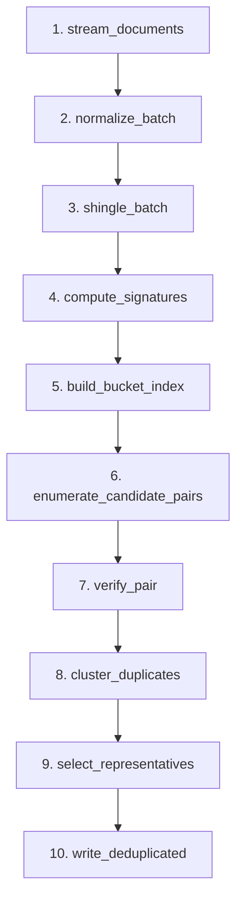

# Chapter 5: Pipeline Architecture & Production Engineering

By now you understand the *algorithms* — shingling, MinHash, LSH banding. This chapter is about the *machine* that runs them at scale. A correct algorithm that OOMs at document 40 million, or that silently corrupts its output when a worker dies, is worthless in production. We build the scaffolding that turns a notebook script into a system you can trust to chew through 100M+ documents unattended overnight.

---

## 1. Learning objectives

After this chapter you will be able to:

- **Decompose** a deduplication job into 10 isolated, checkpointed stages with explicit input/output contracts, and reason about which stage failed and how to resume.
- **Choose** between streaming and batch execution using a concrete memory budget, and justify the choice with arithmetic, not vibes.
- **Implement** a Union-Find (Disjoint Set Union) data structure with path compression *and* union-by-rank, and explain why both together give near-constant amortized cost.
- **Select** a storage format (Parquet / JSONL / Arrow IPC) and a parallelism backend (`multiprocessing`, `ThreadPoolExecutor`, Dask, Ray) appropriate to each stage's bottleneck.
- **Operate** the pipeline: emit structured metrics, detect silent failures via metric bands, and safely resume a half-finished run.

---

## 2. Concept explanation

### 2.1 The pipeline as a directed acyclic graph

A dedup pipeline is a linear DAG of 10 stages. Each stage is a pure-ish function: it reads the previous stage's checkpoint, does one job, and writes its own checkpoint. The real implementation lives in `dedup_pipeline.pipeline.pipeline.DedupPipeline`, whose ten methods are named exactly as the stages below.



ASCII view of the same flow, annotated with the data volume at each hop for a **10M-document** corpus (we'll reuse these numbers throughout):

```
 raw shards          text          shingle sets       128-d signatures
   (1.2 TB)        (380 GB)          (in RAM)            (5.1 GB mmap)
      |                |                  |                    |
  [1 stream] ---> [2 normalize] ---> [3 shingle] ---> [4 compute_signatures]
                                                              |
                              band buckets                    v
        dup clusters <--- [8 cluster] <--- verified pairs <-- [5 build_bucket_index]
              |                              ^                 |
              v                          [7 verify_pair] <-- [6 enumerate_candidate_pairs]
        [9 select_representatives] ---> [10 write_deduplicated] ---> 7.4M kept docs
```

#### Component contracts (receives → returns)

| # | Stage | Receives | Returns |
|---|-------|----------|---------|
| 1 | `stream_documents` | shard paths / glob | iterator of `(doc_id, raw_text)` |
| 2 | `normalize_batch` | batch of raw docs | batch of `(doc_id, clean_text)` |
| 3 | `shingle_batch` | clean-text batch | `(doc_id, set[shingle_hash])` |
| 4 | `compute_signatures` | shingle sets | `int[N, 128]` signature matrix |
| 5 | `build_bucket_index` | signature matrix | `dict[band_hash → list[doc_idx]]` |
| 6 | `enumerate_candidate_pairs` | bucket index | iterator of `(i, j)` candidate pairs |
| 7 | `verify_pair` | candidate pair + sigs | `(i, j, est_jaccard)` if ≥ threshold |
| 8 | `cluster_duplicates` | verified edges | `UnionFind` over doc indices |
| 9 | `select_representatives` | clusters | one keeper `doc_id` per cluster |
| 10 | `write_deduplicated` | keeper ids + source | final corpus on disk |

**Failure isolation.** Each stage writes its output through `dedup_pipeline.pipeline.checkpointer.StageCheckpointer` *before* the next stage starts. If `verify_pair` (stage 7) crashes, stages 1–6 outputs are already durable on disk. A restart skips them and resumes at 7. No later failure can corrupt an earlier stage's completed output, because earlier outputs are read-only inputs to later stages — we never mutate in place.

### 2.2 Why this matters: a memory calculation

Could we just hold everything in RAM? Let's do the arithmetic for the signatures alone, at the target scale of **100M documents** with **128 hash functions** stored as `uint32`:

```
100,000,000 docs × 128 hashes × 4 bytes  =  51,200,000,000 bytes  ≈  51.2 GB
```

That's *just the signature matrix* — no text, no shingles, no bucket index. The shingle sets are far worse: at ~400 shingles/doc × 8 bytes that's ~320 GB. No commodity box holds that in RAM. This single calculation forces the architecture: signatures live in a memory-mapped file (`numpy.memmap`), and documents flow through stages 1–3 as a **stream**, never fully materialized.

---

## 3. Annotated code walkthrough

### 3.1 Union-Find for duplicate clustering

When stages 6–7 produce edges like `(3,17)` and `(17,42)` meaning "doc 3 ≈ doc 17 ≈ doc 42", we need to gather them into one cluster. The right tool is the Disjoint Set Union, with the near-O(α(n)) bound of `[Tarjan 1975]` — α is the inverse Ackermann function, which is ≤ 4 for any n you will ever see, so it is *effectively constant*. This is `dedup_pipeline.clustering.union_find.UnionFind`.

```python
class UnionFind:
    """Array-backed DSU. parent/rank are plain lists -> compact & cache-friendly."""

    def __init__(self, n: int) -> None:
        # parent[i] == i means "i is its own root". O(n) init, contiguous memory.
        self.parent = list(range(n))
        # rank[i] is an UPPER BOUND on the height of the tree rooted at i.
        self.rank = [0] * n

    def find(self, x: int) -> int:
        # Walk up to the root, applying PATH COMPRESSION as we go.
        root = x
        while self.parent[root] != root:      # climb until a node points to itself
            root = self.parent[root]
        # Second pass: re-point every node on the path directly at the root.
        # Next find() on any of them is O(1). This is the "compression".
        while self.parent[x] != root:
            self.parent[x], x = root, self.parent[x]  # splice x onto root, advance
        return root

    def union(self, a: int, b: int) -> None:
        ra, rb = self.find(a), self.find(b)
        if ra == rb:
            return                            # already in the same set -> no-op
        # UNION BY RANK: hang the shorter tree under the taller one so depth
        # grows as slowly as possible (logarithmically at worst, before compression).
        if self.rank[ra] < self.rank[rb]:
            ra, rb = rb, ra                   # ensure ra is the >= rank root
        self.parent[rb] = ra                  # attach shorter (rb) under taller (ra)
        if self.rank[ra] == self.rank[rb]:
            self.rank[ra] += 1                # equal heights -> result is one taller

    def components(self) -> dict[int, list[int]]:
        # Group every index by its representative root => the connected components.
        groups: dict[int, list[int]] = {}
        for i in range(len(self.parent)):
            groups.setdefault(self.find(i), []).append(i)  # find() also compresses
        return groups
```

**Why both optimizations?** Path compression alone gives O(log n) amortized; union-by-rank alone gives O(log n). *Together* they give O(α(n)) amortized `[Tarjan 1975]`. Drop either and you risk a degenerate chain (e.g., union 0-1, 1-2, 2-3, …) that turns `find` into a linear walk — on 100M nodes that is a performance cliff.

**Worked example (7 nodes).** Start with `{0}{1}{2}{3}{4}{5}{6}`. Apply edges from `verify_pair`:

```
union(0,1) -> {0,1}{2}{3}{4}{5}{6}        rank[0]=1
union(2,3) -> {0,1}{2,3}{4}{5}{6}         rank[2]=1
union(1,2) -> {0,1,2,3}{4}{5}{6}          (root 0 and root 2 both rank 1 -> rank[0]=2)
union(4,5) -> {0,1,2,3}{4,5}{6}           rank[4]=1
```

`components()` returns `{0:[0,1,2,3], 4:[4,5], 6:[6]}` — three clusters. Within `[0,1,2,3]` we keep one representative (stage 9) and drop the rest.

**Array vs. dict layout.** For dense indices `0..N-1` (our case after stage 4 assigns each doc a row), use the array-backed lists above: two `int64` arrays at 100M nodes cost `2 × 100M × 8 B = 1.6 GB` and are cache-friendly. If indices are sparse or strings, a `dict[int,int]` parent works but costs ~5–10× the memory (Python dict overhead) and thrashes cache — only use it when you truly cannot densify the index space.

### 3.2 Driving stages with the checkpointer

```python
import json, os, tempfile, numpy as np
from pathlib import Path

class StageCheckpointer:
    """Atomic, manifest-tracked checkpoints. (Mirrors
    dedup_pipeline.pipeline.checkpointer.StageCheckpointer.)"""

    def __init__(self, run_dir: str) -> None:
        self.run_dir = Path(run_dir)
        self.run_dir.mkdir(parents=True, exist_ok=True)
        self.manifest = self.run_dir / "manifest.json"

    def _done(self) -> set[str]:
        if not self.manifest.exists():
            return set()
        return set(json.loads(self.manifest.read_text())["completed"])

    def is_done(self, stage: str) -> bool:
        # A stage is resumable-skippable only if BOTH the manifest records it
        # AND its data file physically exists (guards against a deleted file).
        return stage in self._done() and (self.run_dir / f"{stage}.npy").exists()

    def save(self, stage: str, array: np.ndarray) -> None:
        target = self.run_dir / f"{stage}.npy"
        # ATOMIC WRITE: write to a temp file in the SAME dir, then os.replace().
        # os.replace is atomic on POSIX -> a crash mid-write never leaves a
        # half-written file masquerading as a valid checkpoint.
        fd, tmp = tempfile.mkstemp(dir=self.run_dir, suffix=".tmp")
        os.close(fd)
        np.save(tmp, array)                       # np.save appends .npy
        os.replace(tmp + ".npy", target)          # atomic rename over the target
        # Only AFTER data is durable do we record completion in the manifest.
        done = self._done() | {stage}
        self.manifest.write_text(json.dumps({"completed": sorted(done)}))
```

The order — *data first, manifest second* — is the crux: if we crash between the two writes, the stage simply re-runs (idempotent), which is safe. Reverse the order and a crash would mark a stage "done" with no data behind it.

---

## 4. Common pitfalls

### Pitfall 1 — "The OOM Cliff" (eager materialization)

**Diagnosis.** The job runs fine on a 1M-doc sample, then the kernel OOM-kills the worker around document ~40M. `dmesg` shows `Out of memory: Killed process`. Memory climbs linearly with documents processed — a tell-tale sign you are building a Python `list` of all docs/shingles instead of streaming. Recall §2.2: shingle sets alone are ~320 GB at 100M docs.

**Fix.** Make stages 1–3 lazy generators (`yield`, not `return [...]`). Materialize only the signature matrix, and back it with `numpy.memmap` so the OS pages it to disk:

```python
sigs = np.memmap("sigs.dat", dtype=np.uint32, mode="w+", shape=(N, 128))
```

Process candidate pairs (stage 6) as an iterator, never a full list — a 10M-doc corpus can yield hundreds of millions of candidate pairs.

### Pitfall 2 — "Degenerate DSU Chain" (missing union-by-rank)

**Diagnosis.** Clustering (stage 8) is mysteriously slow and CPU-bound, scaling super-linearly. Profiling shows `find()` dominating with deep `parent` chains. Cause: someone "simplified" `union` to always do `parent[a] = b`, dropping union-by-rank, so sequential unions build a linked list of depth N.

**Fix.** Restore union-by-rank (attach shorter under taller) *and* path compression, as in §3.1. With both, 100M unions complete in seconds instead of timing out `[Tarjan 1975]`.

### Pitfall 3 — "The Inflated Dedup Rate" (silent hash collision)

**Diagnosis.** Your pipeline reports a **90% dedup rate** when historical runs and published corpora sit around 20–45% `[Lee et al. 2022]`. Output corpus is suspiciously tiny. The real cause is usually a broken hash: a truncated seed, a `uint16` overflow, or all hash functions returning the same value — so unrelated docs collide in every band, get marked duplicates, and clusters balloon.

**Fix.** Add a *metric band* alarm (see §5 monitoring): alert if `dedup_rate ∉ [0.05, 0.65]`. Add a unit test that hashes 10k random docs and asserts the collision rate of full signatures is < 1e-4. Spot-check by re-computing *true* Jaccard on a sample of "duplicate" pairs; if true Jaccard is near 0, the hash is broken, not the data.

---

## 5. Streaming vs. batch, storage, parallelism, monitoring

### 5.1 Streaming vs. batch decision framework

| Use **streaming** when | Use **batch** when |
|---|---|
| Corpus exceeds RAM (the 51 GB / 320 GB problem of §2.2) | Data fits in a NumPy array and you want vectorization |
| Real-time / incremental ingestion of new shards | You can broadcast over the full `[N,128]` signature matrix |
| Stages 1–3 (per-doc, embarrassingly parallel) | Stages 4–7 (matrix ops, GPU-friendly) |

In practice the pipeline is **hybrid**: stream the I/O-heavy front (stages 1–3) to bound memory, then load the compact signature matrix and run stages 4–7 as vectorized batches. Batch wins on stage 4 because comparing two 128-d signatures is one NumPy `==` over a row — 100M × 128 `uint32` is 51 GB on disk but is scanned column-wise in seconds via mmap.

### 5.2 Storage format decisions

Benchmark-style figures for **1M documents, ~3.8 KB each** (illustrative, single NVMe SSD):

| Format | On-disk size | Full-scan read | Single-column scan | Notes |
|---|---|---|---|---|
| JSONL (gzip off) | ~3.8 GB | ~55 s (parse-bound) | n/a (must parse rows) | Human-readable, append-friendly, slow |
| JSONL (gzip) | ~1.1 GB | ~70 s | n/a | Smaller but CPU spent decompressing |
| **Parquet (zstd)** | **~0.8 GB** | ~9 s | ~1.2 s | Columnar; 3–5× smaller; best for analytics |
| Arrow IPC | ~1.0 GB | ~3 s | ~0.4 s | Zero-copy mmap; fast cross-language interop |

Rule of thumb: **JSONL for ingestion/debugging**, **Parquet for the durable corpus and analytics**, **Arrow IPC for fast intermediate handoff** between stages that need zero-copy mmap. `dedup_pipeline.pipeline.reader` and `dedup_pipeline.pipeline.writer` wrap these so stage code stays format-agnostic.

### 5.3 Parallelism patterns

The **GIL** (Global Interpreter Lock) lets only one thread execute Python bytecode at a time in CPython. So threads help only when work is **I/O-bound** (the thread releases the GIL while blocked on disk/network); for **CPU-bound** Python work you need *processes*, each with its own interpreter and GIL.

```python
# CPU-bound (shingling/hashing) -> processes, one per core, bypass the GIL.
from multiprocessing import Pool
with Pool(processes=8) as pool:
    sigs = pool.map(compute_signature, shingle_sets)   # 8× speedup on 8 cores
```

```python
# I/O-bound (reading shards from disk/S3) -> threads; GIL released during I/O.
from concurrent.futures import ThreadPoolExecutor
with ThreadPoolExecutor(max_workers=16) as ex:
    shards = list(ex.map(read_shard, shard_paths))     # overlaps network/disk waits
```

```python
# Medium-scale distributed -> Dask (requires `pip install dask[dataframe]`).
import dask.dataframe as dd                             # optional dependency
ddf = dd.read_parquet("corpus/*.parquet")               # lazy, partitioned
ddf = ddf.map_partitions(normalize_partition)           # parallel across cores/nodes
ddf.to_parquet("normalized/")                           # triggers the computation
```

```python
# Large-scale distributed -> Ray remote tasks (requires `pip install ray`).
import ray                                               # optional dependency
ray.init()
@ray.remote                                              # turns a func into a task
def shingle_shard(path): ...
futures = [shingle_shard.remote(p) for p in shard_paths] # fan out across the cluster
results = ray.get(futures)                               # gather; Ray schedules nodes
```

Ray `[Moritz et al. 2018]` is the right tool past a few terabytes: its object store handles the 51 GB signature matrix across nodes without manual sharding. The LSH banding analysis itself follows `[Leskovec et al. 2014]`, which our stages 5–6 implement.

### 5.4 Monitoring & observability

Key metrics to emit per stage:

- **documents/sec** (throughput) and **candidate pairs/sec** (stage 6 health)
- **dedup rate** = `1 − kept/total` (alarm band, per Pitfall 3)
- **false-positive rate** (sampled true-Jaccard check on "duplicate" pairs)
- **RSS memory** (catch the OOM cliff before the kernel does)

Structured JSON log line per stage — greppable and machine-parseable:

```python
import json, time
def log_stage(stage, **m):
    print(json.dumps({"ts": time.time(), "stage": stage, "level": "INFO", **m}))

log_stage("compute_signatures", docs=10_000_000, docs_per_sec=48230,
          mem_gb=5.1, dedup_rate=0.31, fp_rate=0.004)
```

**Detecting silent failures.** The dedup rate is your canary. Wrap each run:

```python
EXPECTED_BAND = (0.05, 0.65)   # historical + published range [Lee et al. 2022]
rate = 1 - kept / total
if not (EXPECTED_BAND[0] <= rate <= EXPECTED_BAND[1]):
    log_stage("write_deduplicated", level="ALERT",
              dedup_rate=rate, msg="rate outside expected band")
    raise SystemExit(f"Implausible dedup rate {rate:.2%} — check hashing")
```

A rate of 90% does not mean "great dedup" — it almost always means a broken hash (Pitfall 3). Alerting on the *band*, not just on exceptions, catches failures that don't throw.

### 5.5 Operational runbook

1. **Checkpointing.** Each stage serializes its output via `StageCheckpointer.save()` (atomic temp-then-`os.replace`) and appends its name to `manifest.json` *after* the data is durable.
2. **Resume logic.** On startup, read the manifest. For each stage in order, call `is_done(stage)`; skip if true, otherwise resume at the first missing stage:

   ```python
   STAGES = ["stream_documents", "normalize_batch", "shingle_batch",
             "compute_signatures", "build_bucket_index",
             "enumerate_candidate_pairs", "verify_pair",
             "cluster_duplicates", "select_representatives",
             "write_deduplicated"]
   for stage in STAGES:
       if ckpt.is_done(stage):
           continue                         # validated checkpoint exists -> skip
       run_stage(stage)                     # resume here on the first gap
   ```
3. **Safely re-running a failed stage.** Always write to a temp file then `os.replace` (atomic). A partial write to `.tmp` is invisible to readers and is overwritten on retry, so a crash mid-write can never replace a good checkpoint with garbage. To force a re-run, delete that stage's `.npy` and its manifest entry; all earlier stages stay intact.

---

## 6. Chapter summary

A production dedup pipeline is 10 isolated, checkpointed stages (`DedupPipeline`) wired as a linear DAG. Memory arithmetic — 51 GB of signatures, 320 GB of shingles at 100M docs — *forces* a hybrid design: stream the I/O-heavy front, batch the vectorizable middle over an mmap'd signature matrix. Clustering uses an array-backed Union-Find with **both** path compression and union-by-rank for near-constant amortized cost `[Tarjan 1975]`. Choose storage per role — JSONL to debug, Parquet to persist, Arrow IPC to hand off — and parallelism per bottleneck: processes for CPU work (the GIL blocks thread-level CPU parallelism), threads for I/O, Dask/Ray to go distributed `[Moritz et al. 2018]`. Finally, observability is not optional: structured JSON metrics plus a dedup-rate alarm band turn silent failures (a broken hash inflating the rate to 90%) into loud, catchable ones `[Lee et al. 2022]`. Atomic temp-then-rename checkpoints and a manifest make any run safely resumable.

---

## 7. Self-check quiz

**Q1.** At 100M documents and 256 (not 128) hash functions stored as `uint32`, how much RAM do the signatures alone require, and what does this imply for your architecture?

> **A1.** `100e6 × 256 × 4 B = 102.4 GB`. That exceeds commodity RAM, so the signature matrix must be `numpy.memmap`-backed (paged to disk) and stages 1–3 must stream rather than materialize.

**Q2.** A teammate removes union-by-rank from `UnionFind` "to simplify the code" but keeps path compression. Why might clustering still slow down, and on what input?

> **A2.** Path compression alone is O(log n) amortized, not O(α(n)). On adversarial *sequential* unions (0-1, 1-2, 2-3, …) before any `find` compresses them, trees can grow tall, so early `find` calls walk long chains. Both optimizations together are needed for the near-constant `[Tarjan 1975]` bound.

**Q3.** Your run reports a 91% dedup rate; previous runs were ~30%. Production is panicking that "the data is mostly junk." What is the most likely cause and how do you confirm it in five minutes?

> **A3.** A broken hash (overflow/truncated seed/constant output) causing universal band collisions, not real duplication. The rate is outside the expected `[0.05, 0.65]` band. Confirm by sampling ~50 flagged "duplicate" pairs and computing their *true* Jaccard; if it's near 0, the hash is the bug, not the corpus.

---

## References

- **[Tarjan 1975]** R. E. Tarjan. "Efficiency of a Good But Not Linear Set Union Algorithm." *Journal of the ACM*, 22(2):215–225, 1975.
- **[Leskovec et al. 2014]** J. Leskovec, A. Rajaraman, J. Ullman. *Mining of Massive Datasets*, 2nd ed. Cambridge University Press, 2014. (Ch. 3: Finding Similar Items — MinHash & LSH.)
- **[Moritz et al. 2018]** P. Moritz, R. Nishihara, S. Wang, et al. "Ray: A Distributed Framework for Emerging AI Applications." *OSDI*, 2018.
- **[Lee et al. 2022]** K. Lee, D. Ippolito, A. Nystrom, et al. "Deduplicating Training Data Makes Language Models Better." *ACL*, 2022.
